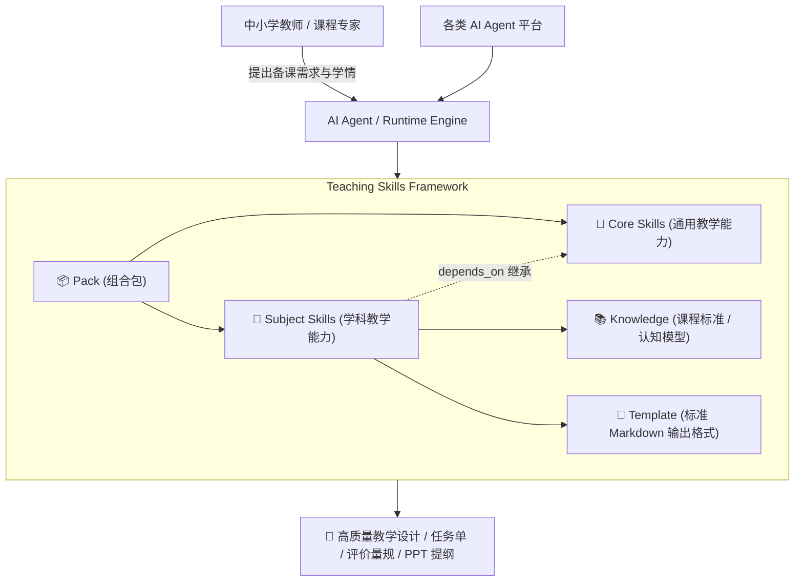

# Teaching Skills Framework (教学技能框架)

<p align="center">
  <strong>面向中小学教师与 AI Agent 的模块化、可组合、学科化教学 AI Skill 开源框架</strong>
  <br>
  <em>A Modular, Composable, Subject-Aware AI Teaching Skills Framework for K-12 Educators and Autonomous Agents</em>
</p>

<p align="center">
  <a href="LICENSE"></a>
  <a href="package.json"></a>
  <a href="docs/specifications/skill-spec.md"></a>
  <a href="docs/architecture/overview.md"></a>
</p>

---

## 🌟 为什么需要 Teaching Skills Framework？

当前绝大多数 AI 辅助教学工具或提示词仓库存在以下核心痛点：

1. **Prompt 是一次性的黑盒**：将“课程标准、教材版本、学情、教学步骤、格式要求”全部揉碎在一个超长 Prompt 里，难以复用、维护和版本管理。
2. **缺乏学科教学法深度**：大模型往往输出泛泛而谈的“教学设计套话”，缺乏对信息科技的**计算思维/算法思维/调试支架**，或技术与工程的**真实问题/工程决策/技术试验/迭代制作**等学科特有认知规律的支撑。
3. **学科与底层能力强耦合**：无法将通用的“教学设计、活动设计、评价量规”与学科特有的“编程教学、工程制图”解耦复用。
4. **绑定单一模型平台**：难以无缝迁移至 Claude Code、Antigravity、Cursor、OpenAI GPT、Dify、Coze 等多样化 Agent 运行环境。

> 💡 **重要声明**：  
> **本项目绝不是一个普通的 Prompt 提示词合集。**  
> 它是面向基础教育的 **Teaching Skill Framework（教学能力工程化框架）**。我们将教学能力抽象为工业级可组合、可继承、可校验、可扩展的微单元（Skill），将教学知识库（Knowledge）和输出标准（Template）解耦，为下一代教育 AI Agent 提供标准协议。

---

## 🧩 核心理念与抽象模型

框架建立在六大核心概念之上：

```
Teaching Framework
  │
  ├── 🎯 Skill (教学能力)        -> "做什么"：如通用教学设计、编程教学、工程设计
  ├── 📚 Knowledge (教学知识)    -> "知道什么"：如课程标准、学科概念、教学策略、常见误区
  ├── 📝 Template (输出模板)     -> "输出成什么"：如教学设计、任务单、评价量规、逐字稿
  ├── 📦 Pack (能力组合包)       -> "如何组装"：如高中信息科技教学包、高中技术与工程教学包
  ├── 💡 Example (应用案例)      -> "如何运转"：输入 → Skill → Knowledge → 输出
  └── ⚙️ Runtime (执行环境)      -> "运行机制"：解析、依赖注入、提示管道、生成与校验
```



---

## 🏛️ 核心架构原则

1. **Modular (模块化)**：每个 Skill 职责单一，边界清晰。
2. **Composable (可组合)**：Skill 支持通过 `depends_on` 继承与组合，避免重复造轮子。
3. **Subject-aware (学科感知)**：深入学科本质，感知不同学科特有的教学规律与素养目标。
4. **Knowledge-driven (知识驱动)**：课标与学科知识外部化，随新课标与教材平滑升级。
5. **Agent-friendly & Machine-readable**：标准 YAML 元数据与确定性工作流，便于 AI Agent 解析与执行。
6. **Human-readable (人类可读)**：一线教师可直接查阅 Markdown，自主修改调整。
7. **Versionable (可版本化)**：Skill、Knowledge、Pack 均采用语义化版本管理。
8. **Extensible (平滑扩展)**：未来支持数学、物理、化学、生物、语文、英语等多学科平滑接入，核心层零改动。
9. **Portable (平台无关)**：标准 Markdown/YAML 结构，不绑定任何模型厂商或 Agent 平台。
10. **Local-first (本土适配)**：深度契合中国大陆《义务教育课程标准》与《普通高中课程标准》。

---

## 📂 仓库目录结构

```text
teaching-skills/
├── .github/                       # GitHub 自动化工作流与 Issue/PR 模板
├── docs/                          # 官方设计规范与架构文档
│   ├── architecture/              # 总体、Skill、Knowledge、Pack、Runtime 架构
│   ├── specifications/            # Skill Spec 与 Manifest Spec 规格
│   ├── development/               # 创建与验证 Skill 实战指南
│   └── tutorials/                 # 入门与组装教程
│
├── skills/                        # 🎯 教学技能库
│   ├── core/                      # 通用教学能力 (不含任何具体学科硬编码)
│   │   ├── lesson-design/         # 通用教学设计
│   │   ├── activity-design/       # 课堂学习活动设计
│   │   ├── assessment-design/     # 学习评价设计
│   │   ├── rubric-design/         # 评价量规设计
│   │   ├── project-learning/      # 项目式学习 (PBL) 通用设计
│   │   └── teaching-reflection/   # 课后教学反思与改进
│   │
│   ├── information-technology/    # 💻 信息科技技能集
│   │   ├── programming/           # 编程教学设计 (PRIMM模型/脚手架)
│   │   ├── algorithm/             # 算法与计算思维教学
│   │   ├── data/                  # 数据与数据处理教学
│   │   ├── artificial-intelligence/# 人工智能素养与原理教学
│   │   ├── computational-thinking/# 计算思维四维度系统培养
│   │   ├── project-learning/      # 信息科技数字化产品项目学习
│   │   ├── primm-debugger/        # PRIMM 编程思维与认知调试助教 (时序推演/探针调试)
│   │   └── woodpecker-auditor/    # 信息科技教案啄木鸟审计 (语法负荷/CT显性化/探究留白)
│   │
│   ├── technology-engineering/    # 🛠️ 技术与工程技能集 (体现工程思维闭环)
│   │   ├── technology-design/     # 技术设计 (结构/流程/系统/控制)
│   │   ├── engineering-design/    # 工程设计 (真实约束与方案权衡)
│   │   ├── project-learning/      # 工程项目式学习
│   │   ├── prototyping/           # 样品制作与原型加工
│   │   ├── testing-iteration/     # 试验测试与迭代优化
│   │   ├── technical-practice/    # 技术实践与工匠素养
│   │   ├── woodpecker-auditor/    # 啄木鸟教案审计专家 (三道防线/IMA 59册教材)
│   │   └── toulmin-assistant/     # 图尔敏论证式工程助教 (认知摩擦/思辨自辩)
│   │
│   └── physics/                   # 🔬 物理学科技能集 (STEM 探究基石)
│       └── experiment-inquiry/    # DIS 数字化实验探究教学 (传感器采集/图象拟合/误差归因)
│
├── knowledge/                     # 📚 外部知识库
│   ├── common/                    # 通用教育学/课程标准/评价模型
│   ├── information-technology/    # 信息科技课标、计算思维模型、教学法
│   ├── technology-engineering/    # 通用技术课标、工程思维闭环模型
│   └── physics/                   # 高中物理课标与核心素养框架
│
├── templates/                     # 📝 标准化输出模板
│   ├── lesson-plan/               # 标准教学设计方案
│   ├── teaching-script/           # 教学逐字稿
│   ├── task-sheet/                # 课堂学习任务单
│   ├── assessment/                # 过程性与总结性评价表
│   ├── project/                   # 项目学习方案与任务书
│   └── presentation/              # 教学课件提纲与板书设计
│
├── packs/                         # 📦 学科能力组合包
│   ├── information-technology/    # 高中信息科技学科包
│   └── technology-engineering/    # 高中技术与工程学科包
│
├── examples/                      # 💡 真实教学案例
├── tests/                         # 🧪 静态校验与单元测试
├── scripts/                       # 🛠️ 自动化校验与构建工具
├── README.md                      # 项目中枢文档
├── CONTRIBUTING.md                # 贡献指南
├── CHANGELOG.md                   # 版本变更记录
└── package.json                   # 依赖与脚本配置
```

---

## 🎯 核心技能库与文档索引 (Skills Directory & Documentation)

框架内全量收录的 **23 项专业教学技能** 均配有独立的专用说明文档（`README.md`）与执行规约（`SKILL.md`）。  
点击下表中对应的 **文档链接**，可查阅该技能的理论依据、认知红线、素养映射与完整实战交互范例：

### 📚 1. 通用教学法基座技能集 (Common Core, 6 项)
通用技能集严格遵循经典教育学理论（布鲁姆目标分类学、加涅教学九事件、教学评一致性、逆向设计 UbD），为各分学科技能提供底层支撑：

| 技能标识 (ID) | 技能名称 | 核心功能与定位说明 | 专属文档与规约 |
| :--- | :--- | :--- | :---: |
| `core.lesson-design` | **通用教学设计** | 规范课时教学设计方案，指导学情分析、撰写 ABCD 目标与教-学-评对齐 | [📖 README](skills/core/lesson-design/README.md) · [📜 SKILL](skills/core/lesson-design/SKILL.md) |
| `core.activity-design` | **课堂活动设计** | 以学生为中心的任务单设计，基于加涅教学事件规划驱动问题与探究支架 | [📖 README](skills/core/activity-design/README.md) · [📜 SKILL](skills/core/activity-design/SKILL.md) |
| `core.assessment-design` | **学习评价设计** | 过程性与总结性兼备的评价方案，涵盖随堂观察检核、阶段诊断与表现性任务 | [📖 README](skills/core/assessment-design/README.md) · [📜 SKILL](skills/core/assessment-design/SKILL.md) |
| `core.rubric-design` | **评价量规设计** | 高质量分析型量规（Rubric），建立多维度、4 等级的可测质性评价锚点 | [📖 README](skills/core/rubric-design/README.md) · [📜 SKILL](skills/core/rubric-design/SKILL.md) |
| `core.project-learning` | **项目式学习设计** | K-12 跨学科 PBL 单元设计，确立驱动性问题、进阶里程碑与公开展示 | [📖 README](skills/core/project-learning/README.md) · [📜 SKILL](skills/core/project-learning/SKILL.md) |
| `core.teaching-reflection` | **教学反思与改进** | 基于课堂实证数据的课后反思，诊断意外学情并提供教案再迭代策略 | [📖 README](skills/core/teaching-reflection/README.md) · [📜 SKILL](skills/core/teaching-reflection/SKILL.md) |

### 💻 2. 信息科技学科技能集 (Information Technology, 8 项)
聚焦中小学信息科技课标，突出**计算思维（分解、模式识别、抽象、算法）**系统化培养，具备完备的备课审计与机房认知调试双旗舰：

| 技能标识 (ID) | 技能名称 | 核心功能与特色亮点 | 专属文档与规约 |
| :--- | :--- | :--- | :---: |
| `it.programming` | **编程教学设计** | 自然语言 ➔ 伪代码 ➔ 流程图 ➔ 代码渐进式脚手架，防语法死记硬背 | [📖 README](skills/information-technology/programming/README.md) · [📜 SKILL](skills/information-technology/programming/SKILL.md) |
| `it.algorithm` | **算法思维教学** | 枚举、二分、查找、排序、递归等经典算法教学，指导时空复杂度评估 | [📖 README](skills/information-technology/algorithm/README.md) · [📜 SKILL](skills/information-technology/algorithm/SKILL.md) |
| `it.data` | **数据处理教学** | 数据编码、二维数据统计、可视化表达与数据爬虫真实情境应用 | [📖 README](skills/information-technology/data/README.md) · [📜 SKILL](skills/information-technology/data/SKILL.md) |
| `it.artificial-intelligence` | **人工智能教学** | 机器学习体验、计算机视觉、大模型原理及数据隐私与 AI 伦理思辨 | [📖 README](skills/information-technology/artificial-intelligence/README.md) · [📜 SKILL](skills/information-technology/artificial-intelligence/SKILL.md) |
| `it.computational-thinking` | **计算思维培养** | 无插电（CS Unplugged）与编程上机双轨驱动，复杂现实问题形式化建模 | [📖 README](skills/information-technology/computational-thinking/README.md) · [📜 SKILL](skills/information-technology/computational-thinking/SKILL.md) |
| `it.project-learning` | **信息科技项目学习** | 数字化产品全流程设计，指导微型系统开发、智能物联小车与仪表盘发布 | [📖 README](skills/information-technology/project-learning/README.md) · [📜 SKILL](skills/information-technology/project-learning/SKILL.md) |
| ⭐ `it.primm-debugger` | **PRIMM 调试助教**<br>*(学生端旗舰)* | **阻断 AI 代写代改代码**。依据 PRIMM 模型，凭 Traceback 门禁放行，单步追问 $\le 150$ 字 | [📖 README](skills/information-technology/primm-debugger/README.md) · [📜 SKILL](skills/information-technology/primm-debugger/SKILL.md) |
| ⭐ `it.woodpecker-auditor` | **IT 教案啄木鸟**<br>*(教师端旗舰)* | **三道防线审计**：严打“语法泡沫”、“计算思维虚化”与“直接投喂源码照抄”，严禁代写 | [📖 README](skills/information-technology/woodpecker-auditor/README.md) · [📜 SKILL](skills/information-technology/woodpecker-auditor/SKILL.md) |

### 🛠️ 3. 技术与工程学科技能集 (Technology & Engineering, 8 项)
聚焦普通高中通用技术课标，严格落地**工程思维闭环（需求分析 ➔ 方案构思 ➔ 物化成型 ➔ 破坏测试 ➔ 权衡决策）**：

| 技能标识 (ID) | 技能名称 | 核心功能与特色亮点 | 专属文档与规约 |
| :--- | :--- | :--- | :---: |
| `te.technology-design` | **技术设计基础教学** | 必修2四大核心主题：结构与受力、流程时序、系统整体性与闭环控制系统 | [📖 README](skills/technology-engineering/technology-design/README.md) · [📜 SKILL](skills/technology-engineering/technology-design/SKILL.md) |
| `te.engineering-design` | **工程设计与权衡** | 真实工程多目标约束决策，运用矩阵法化解强度、自重、成本冲突（Trade-off） | [📖 README](skills/technology-engineering/engineering-design/README.md) · [📜 SKILL](skills/technology-engineering/engineering-design/SKILL.md) |
| `te.prototyping` | **样品制作与原型加工** | 物化工艺规划、三视图草图、工具安全纪律与现代创客（3D打印/激光切割）加工 | [📖 README](skills/technology-engineering/prototyping/README.md) · [📜 SKILL](skills/technology-engineering/prototyping/SKILL.md) |
| `te.testing-iteration` | **试验测试与迭代优化** | 承重破坏性试验与功能检测，基于应力应变与失效截面反思结构强度与稳定性 | [📖 README](skills/technology-engineering/testing-iteration/README.md) · [📜 SKILL](skills/technology-engineering/testing-iteration/SKILL.md) |
| `te.technical-practice` | **技术实践与工艺实训** | 规范使用金工木工工具，强化劳动安全、装配精度公差与工匠精神 | [📖 README](skills/technology-engineering/technical-practice/README.md) · [📜 SKILL](skills/technology-engineering/technical-practice/SKILL.md) |
| `te.project-learning` | **技术与工程项目学习** | 真实工程挑战 PBL：纸梁承重、自动寻光太阳能板、温室无土栽培环境控制 | [📖 README](skills/technology-engineering/project-learning/README.md) · [📜 SKILL](skills/technology-engineering/project-learning/SKILL.md) |
| ⭐ `te.woodpecker-auditor` | **工程教案啄木鸟**<br>*(教师端旗舰)* | **三道防线严厉审计**：严查素养假大空与手工劳作假工程，联动云端 59 册通用技术教材 | [📖 README](skills/technology-engineering/woodpecker-auditor/README.md) · [📜 SKILL](skills/technology-engineering/woodpecker-auditor/SKILL.md) |
| ⭐ `te.toulmin-assistant` | **图尔敏工程助教**<br>*(学生端旗舰)* | **阻断现成图纸索取**。引导学生运用图尔敏论证模型（主张-论据-推理-权衡）四阶段自辩 | [📖 README](skills/technology-engineering/toulmin-assistant/README.md) · [📜 SKILL](skills/technology-engineering/toulmin-assistant/SKILL.md) |

### 🔬 4. 物理学科与 STEM 探究 (Physics, 1 项)
连接传感器实测数据与数理规律推演的底层科学探究基石：

| 技能标识 (ID) | 技能名称 | 核心功能与特色亮点 | 专属文档与规约 |
| :--- | :--- | :--- | :---: |
| ⭐ `physics.experiment-inquiry` | **DIS 数字化实验探究** | 融合 DIS 力、光电门、位移传感器，重构“猜想控制变量 ➔ 毫秒级采集 ➔ 坐标图象化曲为直拟合 ➔ 阻力误差归因” | [📖 README](skills/physics/experiment-inquiry/README.md) · [📜 SKILL](skills/physics/experiment-inquiry/SKILL.md) |

### 🗺️ 5. 未来平滑扩展路线图 (Roadmap)
由于核心层 Core 与学科层完全解耦，后续将平滑支持以下基础学科扩展接入：
- 📐 **数学 (Mathematics)**: 数学建模、数形结合、逆向题组设计
- 🧪 **化学 (Chemistry)**: 微观-宏观-符号三重表征、化学实验探究
- 🧬 **生物 (Biology)**: 生命观念建构、科学探究与实验设计
- 📖 **语文 (Chinese)**: 任务群学习、群文阅读、情境化写作设计
- 🌍 **英语 (English)**: 主题语境探究、语篇研读、交际任务设计

---

## 🚀 快速上手 (Quick Start)

### 1. 环境准备

本项目采用轻量级 Node.js 驱动校验引擎（无繁重外部依赖）：

```bash
# 克隆仓库
git clone https://github.com/aymwoo/xf-skills.git
cd xf-skills

# 静态验证所有 Skill、Knowledge、Template 与 Pack
npm run validate

# 运行框架测试集
npm test
```

### 2. 使用交互式 CLI 工具 (`xf-skills`)

框架内置零外部依赖的终端命令行工具，支持技能检索、规约查阅与苏格拉底追问模拟：

```bash
# 查看全量技能资产清单 (按学科分类)
node bin/xf-skills.cjs list

# 关键词/意图模糊搜索
node bin/xf-skills.cjs search "闭环控制"
node bin/xf-skills.cjs search "递归"

# 查阅指定技能规格、依赖与红线
node bin/xf-skills.cjs info te.toulmin-assistant

# 启动终端苏格拉底微追问模拟演示 (体验认知摩擦门禁)
node bin/xf-skills.cjs chat it.primm-debugger --mock
```

### 3. 在 AI Agent 中使用 Skill

将对应的 `SKILL.md` 作为 System Context 或 Agent Skill 挂载至任意支持 Markdown 指令的 Agent（如 Antigravity, Claude Code, Cursor, Copilot Workspace 等）：

```text
你是一个专业的高中信息科技骨干教师，请调用并遵循 skills/information-technology/programming/SKILL.md 规范，
结合 knowledge/information-technology/curriculum/curriculum-standards-2022.md 知识库，
为高中一年级学生设计一节《Python 列表遍历与数据统计》教学设计，
输出必须严格符合 templates/lesson-plan/lesson-plan.md 模板。
```

---

## 🛠️ 如何开发一个新的 Skill

每个 Skill 的定义必须遵循以下极简标准工作流：

1. 在 `skills/<subject>/<skill-name>/` 下创建 `SKILL.md`。
2. 编写统一的 **YAML Front Matter**：
   ```yaml
   ---
   id: it.programming
   name: programming
   display_name: 编程教学设计
   version: 0.1.0
   status: experimental
   type: teaching-skill
   subject:
     - information-technology
   education_level:
     - high-school
   depends_on:
     - core.lesson-design
     - core.activity-design
   requires:
     knowledge:
       - information-technology.curriculum
     templates:
       - lesson-plan
       - task-sheet
   outputs:
     - lesson-plan
     - task-sheet
   ---
   ```
3. 遵循标准化 7 步 Workflow：
   `Input` ➔ `Context Analysis` ➔ `Knowledge Retrieval` ➔ `Planning` ➔ `Generation` ➔ `Validation` ➔ `Output`
4. 提供 `README.md`、`examples/` 与 `tests/`。
5. 运行 `npm run validate` 检查合规性。

详细开发教程请阅读：[如何开发一个 Skill](docs/development/create-a-skill.md)。

---

## 📖 核心文档索引

- **系统总体架构**：[docs/architecture/overview.md](docs/architecture/overview.md)
- **Skill 架构规范**：[docs/architecture/skill-architecture.md](docs/architecture/skill-architecture.md)
- **Knowledge 知识架构**：[docs/architecture/knowledge-architecture.md](docs/architecture/knowledge-architecture.md)
- **Pack 组合包架构**：[docs/architecture/pack-architecture.md](docs/architecture/pack-architecture.md)
- **Runtime 预留架构**：[docs/architecture/runtime-architecture.md](docs/architecture/runtime-architecture.md)
- **Skill Specification 规范**：[docs/specifications/skill-spec.md](docs/specifications/skill-spec.md)
- **Manifest Specification 规范**：[docs/specifications/manifest-spec.md](docs/specifications/manifest-spec.md)
- **Skill 静态校验指南**：[docs/development/validate-a-skill.md](docs/development/validate-a-skill.md)

---

## 🤝 参与贡献

我们热忱欢迎一线骨干教师、教研员、教育技术学者与 AI 开发者共同参与建设！  
请查阅 [CONTRIBUTING.md](CONTRIBUTING.md) 了解详细的提交流程与规范。

---

## 📄 开源许可证

本项目基于 [MIT License](LICENSE) 协议开源。
