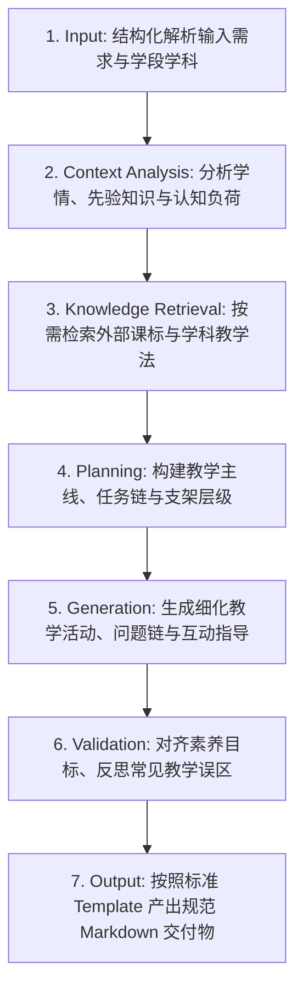

# 架构总览 (Architecture Overview)

本文档系统介绍 **Teaching Skills Framework** 的总体架构设计、分层理念、能力规范、知识库与运行时机制。

---

## 1. 架构目标与定位

Teaching Skills Framework 旨在解决基础教育领域 AI 教学辅助的碎片化、不可复用和缺乏学科特异性等问题。

框架的核心架构目标：
1. **分层清晰**：区分能力（Skill）、知识（Knowledge）、格式（Template）和组装（Pack）。
2. **学科解耦**：Core 通用层提供纯教学法元能力，学科层继承并注入学科特色认知模型，未来多学科（数理化生语英等）可平滑扩充。
3. **平台中立**：以标准 Markdown + YAML 描述，AI Agent 既能作为 Prompt 链加载，也能由自动化 Runtime 解析执行。

---

## 2. 总体逻辑架构图与核心抽象

```
+-----------------------------------------------------------------------------+
|                                User / Agent Layer                           |
|       (K-12 Teachers, Curriculum Designers, Claude, Cursor, Antigravity)   |
+-----------------------------------------------------------------------------+
                                       |
                                       v
+-----------------------------------------------------------------------------+
|                          Runtime / Orchestration Layer                      |
|  [SkillRegistry]  [SkillResolver]  [KnowledgeRetriever]  [PromptPipeline]   |
+-----------------------------------------------------------------------------+
                                       |
          +----------------------------+----------------------------+
          |                            |                            |
          v                            v                            v
+--------------------+       +--------------------+       +-------------------+
|     Pack Layer     |       |    Template Layer  |       |  Knowledge Layer  |
| (packs/it/hs, ...) |       | (lesson-plan, ...) |       | (common, it, te)  |
+--------------------+       +--------------------+       +-------------------+
          |
          v
+-----------------------------------------------------------------------------+
|                                 Skill Layer                                 |
|                                                                             |
|   +---------------------------------------------------------------------+   |
|   |                       Subject Specialized Layer                     |   |
|   |   (e.g., it.programming, it.algorithm, te.engineering-design, ...) |   |
|   +---------------------------------------------------------------------+   |
|                                      | depends_on                           |
|                                      v                                      |
|   +---------------------------------------------------------------------+   |
|   |                           Core Skills Layer                         |   |
|   |   (core.lesson-design, core.activity-design, core.rubric-design, ...) |   |
|   +---------------------------------------------------------------------+   |
+-----------------------------------------------------------------------------+
```

### 六大核心抽象定义

| 抽象实体 | 物理目录 | 核心职责 | 举例 |
| :--- | :--- | :--- | :--- |
| **Skill (技能)** | `skills/` | 定义“做什么”：标准 7 步闭环教学工作流、输入输出约束与质量标准 | `core.lesson-design`, `it.programming` |
| **Knowledge (知识)** | `knowledge/` | 定义“知道什么”：课程标准、学科概念体系、教学策略与常见误区 | `bloom-taxonomy.md`, `curriculum-2022.md` |
| **Template (模板)** | `templates/` | 定义“输出成什么”：标准 Markdown 教学产物输出结构 | `lesson-plan.md`, `task-sheet.md` |
| **Pack (组合包)** | `packs/` | 定义“如何组合”：面向具体学段与学科的一组 Skill + Knowledge 集合 | `pack.it.high-school` |
| **Example (案例)** | `examples/` | 提供真实落地示范：输入参数、上下文、生成结果对照 | `python-sorting-algorithms` |
| **Runtime (运行时)** | `docs/` & `scripts/` | 提供执行、静态校验、依赖解析与生命周期调度规范 | `validator.js`, `SkillResolver` |

---

## 3. Skill 架构与 7 步闭环工作流 (Skill Architecture)

Skill 是 Teaching Skills Framework 中的最小教学能力单元。**Skill 是一个强规范、自包含、具备确定性 Workflow 的微能力引擎**。

```
+----------------------------------------------------------------+
|                            SKILL.md                            |
|                                                                |
|  [YAML Front Matter]                                           |
|  - id, name, display_name, version, status                     |
|  - subject, education_level, depends_on, requires, outputs     |
|                                                                |
|  [Markdown Specification Body]                                 |
|  1. Description & Purpose                                      |
|  2. When to use / When NOT to use                              |
|  3. Inputs & Constraints                                       |
|  4. Standard 7-Step Workflow                                   |
|  5. Quality Evaluation Criteria                                |
|  6. Required Knowledge & Output Templates                      |
+----------------------------------------------------------------+
```

### 标准 7 步闭环工作流 (Unified 7-Step Workflow)



1. **Input (输入)**：解析教师输入的课题、课时、学生基础、可用设备等关键参数。
2. **Context Analysis (情境分析)**：分析对应学段学生的认知特点、前概念及可能出现的认知障碍。
3. **Knowledge Retrieval (知识检索)**：从 `knowledge/` 库中提取对应的课程标准、学科核心素养维度和教学法模型（如 PRIMM 教学法、工程设计循环）。
4. **Planning (教学规划)**：设计整体教学逻辑框架、驱动性任务序列及阶梯式脚手架。
5. **Generation (内容生成)**：生成具体的师生活动、探究引导语、代码实例或工程试验步骤。
6. **Validation (质量校验)**：对照评价标准与常见误区清单进行自检（例如是否落实了计算思维、是否存在安全隐患）。
7. **Output (标准化输出)**：将内容映射注入 `templates/` 中指定的标准模板。

### Skill 的继承与依赖拓扑
- **Core Level**：通用教学设计、活动设计、评价量规。纯粹关注教学法（Pedagogy），与具体学科无绑定。
- **Subject Level**：注入学科特色（如编程、算法、技术设计、制作原型）。
- **Specialized Level**：更微观的专题技能（如调试诊断、论证助教）。

---

## 4. Knowledge 知识库架构 (Knowledge Architecture)

Knowledge 模块负责管理 Teaching Skills Framework 的**外部教学知识库**：
1. **课标与教材解耦**：国家课程标准定期修订，各省市教材版本各异。分离避免了 Prompt 臃肿。
2. **权威概念复用**：布鲁姆教育目标、加涅九步法、计算思维要素、工程设计循环等可跨技能共享。
3. **分层拓扑**：
   - `knowledge/common/`：通用教育教学法、通用课标素养。
   - `knowledge/information-technology/`：信息科技学科知识库（课标、计算思维本体、PRIMM 等教学法）。
   - `knowledge/technology-engineering/`：技术与工程知识库（课标、结构与控制本体、试验法）。
   - `knowledge/physics/`：物理学科知识库（探究模型、传感器、实验规程）。

---

## 5. Pack 组合包架构 (Pack Architecture)

Pack（组合包）是面向真实教学场景（如“高中信息科技新教师备课”、“高中技术与工程项目设计”）组装的一站式能力包：
- 包含 `pack.yaml`（元数据、包含的技能列表、所需知识库、所需模板）。
- 包含 `README.md`（组合包使用指南与落地场景）。
- 支持一键交付与分发。

---

## 6. Runtime 运行时架构 (Runtime Architecture)

```
[教师输入 / Agent Request]
          │
          ▼
┌──────────────────┐
│   SkillRegistry  │ ── 发现并注册所有可用 Skills / Packs
└──────────────────┘
          │
          ▼
┌──────────────────┐
│   SkillResolver  │ ── 拓扑解析 depends_on 依赖图与加载顺序
└──────────────────┘
          │
          ▼
┌──────────────────────┐
│ KnowledgeRetriever   │ ── 根据 Skill.requires 检索并注入学科课标与认知模型
└──────────────────────┘
          │
          ▼
┌──────────────────┐
│  PromptPipeline  │ ── 组装结构化上下文、7步工作流与约束提示词
└──────────────────┘
          │
          ▼
┌──────────────────┐
│ OutputGenerator  │ ── 调用底层模型执行生成 (支持流式传输与重试)
└──────────────────┘
          │
          ▼
┌──────────────────┐
│    Validator     │ ── 校验输出是否符合 Template Schema 及质量基准
└──────────────────┘
          │
          ▼
[最终交付标准化教学产物]
```

核心接口与职责：
- **`SkillRegistry`** / **`SkillLoader`**：全库技能发现与元数据解析。
- **`SkillResolver`**：依赖拓扑排序与环检测。
- **`KnowledgeRetriever`**：多模式知识检索（本地文件系统 / IMA OpenAPI / REST）。
- **`Validator`**：静态契约与输出格式质量门禁。
