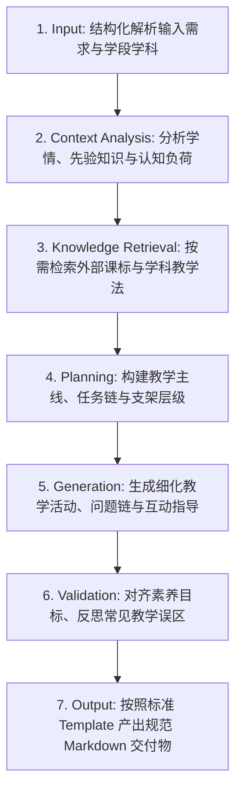

# Skill 架构 (Skill Architecture)

Skill 是 Teaching Skills Framework 中的最小教学能力单元。本文档详细阐述 Skill 的元模型、生命周期及组合关系。

---

## 1. Skill 的设计哲学

传统的教育 AI 提示词通常是一段包含角色、任务和格式的自然语言指令。这种方式有三大弊端：不可复用、难以自动化校验、无法处理复杂的认知支架。

在 Teaching Skills Framework 中，**Skill 是一个强规范、自包含、具备确定性 Workflow 的微能力引擎**。

```
+----------------------------------------------------------------+
|                            SKILL.md                            |
|                                                                |
|  [YAML Front Matter]                                           |
|  - id, name, display_name, version, status                     |
|  - subject, education_level, depends_on, requires, outputs     |
|                                                                |
|  [Markdown Specification Body]                                 |
|  1. Description & Purpose                                      |
|  2. When to use / When NOT to use                              |
|  3. Inputs & Constraints                                       |
|  4. Standard 7-Step Workflow                                   |
|  5. Quality Evaluation Criteria                                |
|  6. Required Knowledge & Output Templates                      |
+----------------------------------------------------------------+
```

---

## 2. 标准 7 步闭环工作流 (Unified 7-Step Workflow)

所有 Skill 在执行时均严格遵循以下 7 步闭环机制：



### 步骤详解
1. **Input (输入)**：解析教师输入的课题、课时、学生基础、可用设备等关键参数。
2. **Context Analysis (情境分析)**：分析对应学段学生的认知特点、前概念及可能出现的认知障碍。
3. **Knowledge Retrieval (知识检索)**：从 `knowledge/` 库中提取对应的课程标准、学科核心素养维度和教学法模型（如 PRIMM 教学法、工程设计循环）。
4. **Planning (教学规划)**：设计整体教学逻辑框架、驱动性任务序列及阶梯式脚手架。
5. **Generation (内容生成)**：生成具体的师生活动、探究引导语、代码实例或工程试验步骤。
6. **Validation (质量校验)**：对照评价标准与常见误区清单进行自检（例如是否落实了计算思维、是否存在安全隐患）。
7. **Output (标准化输出)**：将内容映射注入 `templates/` 中指定的标准模板。

---

## 3. Skill 的继承与依赖拓扑

Skill 之间通过 `depends_on` 建立拓扑依赖关系，形成从通用到学科、再到专题的三层体系：

```
[Core Level]                core.lesson-design        core.assessment-design
                                    ^                         ^
                                    |                         |
[Subject Level]             it.programming             te.engineering-design
                                    ^                         ^
                                    |                         |
[Specialized Level]      it.python-debugging       te.bridge-structure-load
```

- **Core Level**：通用教学设计、活动设计、评价量规。纯粹关注教学法（Pedagogy），与具体学科无绑定。
- **Subject Level**：注入学科特色（如编程、算法、技术设计、制作原型）。
- **Specialized Level**：更微观的专题技能（如某具体工具或实验操作）。
