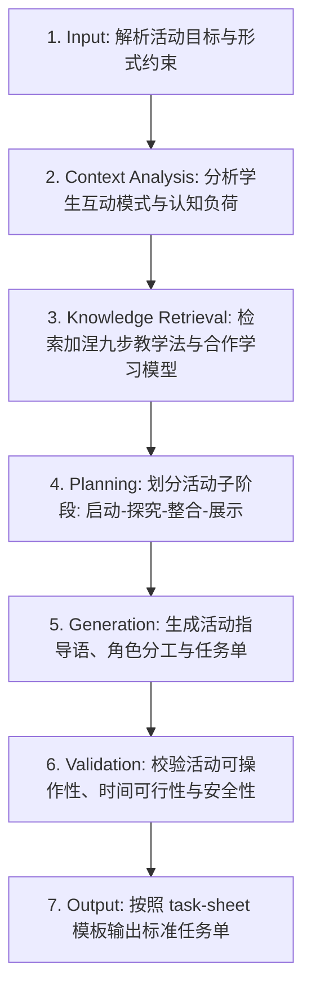

# 课堂学习活动设计 (Activity Design)

## 1. 技能概述 (Description & Purpose)
本技能负责将抽象的教学目标转化为具体的、以学生为中心的探究活动链或小组合作任务，产出结构化的学习任务单与活动指导规则。

## 2. 适用边界 (When to use / When NOT to use)
- **何时使用**：
  - 需要为课堂某个具体难点设计小组合作、动手实验、角色扮演或头脑风暴活动时。
  - 需要编写学生配套的《课堂学习任务单》时。
- **何时不使用**：
  - 需要规划全学期或单元长周期大项目时（建议使用 `core.project-learning`）。

## 3. 输入与约束 (Inputs & Constraints)
- **输入参数**：
  - `learning_objective`: 具体学习目标
  - `activity_type`: 活动形式（个人探究 / 对子互助 / 小组拼图 / 辩论 / 动手实践）
  - `duration`: 活动时长（通常 10-20 分钟）
  - `group_size`: 分组人数
  - `scaffolding_level`: 支架强度（高支架 / 中等支架 / 开放式）
- **教学约束**：
  - 每个活动必须有明确的“交付物/产出物”（如记录表、思维导图、结论汇报词）。
  - 必须包含明确的组内角色分工与时间把控规则。

## 4. 标准执行工作流 (Workflow)

### 环节详解：
1. **Input**：解析活动目标、时长和组织形式。
2. **Context Analysis**：评估同伴互动中的常见阻碍（如个别学生搭便车、任务理解偏差）。
3. **Knowledge Retrieval**：调取加涅事件中的“引发表现”与“提供学习指导”策略。
4. **Planning**：将活动拆解为前置准备、组内探究、成果梳理与全班汇报四个阶梯。
5. **Generation**：输出教师引导脚本、学生任务单问题卡及小组协作规则。
6. **Validation**：检查任务说明是否简明直观，是否提供了必要的提示（Tips）。
7. **Output**：注入 `templates/task-sheet/task-sheet.md` 输出 Markdown 文本。

## 5. 质量评估基准 (Quality Criteria)
- [ ] **指令清晰性**：学生无需反复询问即可理解“做什么、怎么做、何时完成”。
- [ ] **参与全员性**：组内每位成员均有明确职责（如记录员、操作员、发言人）。
- [ ] **高阶思维**：活动超越机械搬运，包含分析、比较、推断或创造环节。

## 6. 关联资源与产物 (Dependencies & Outputs)
- **关联模板**：`templates/task-sheet/task-sheet.md`
- **关联知识**：`knowledge/common/pedagogy/gagne-nine-events.md`
