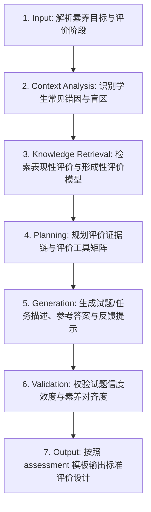

# 学习评价设计 (Assessment Design)

## 1. 技能概述 (Description & Purpose)
本技能负责设计覆盖课堂全过程的形成性评价（Formative Assessment）与总结性评价（Summative Assessment），确保教学目标具有可观测、可测量的评价证据支撑。

## 2. 适用边界 (When to use / When NOT to use)
- **何时使用**：
  - 需要设计课堂提问清单、进门/出门条（Exit Tickets）、快速随堂小测或单元表现性任务时。
- **何时不使用**：
  - 需要细化详细的多维度分级评分标准时（建议使用 `core.rubric-design`）。

## 3. 输入与约束 (Inputs & Constraints)
- **输入参数**：
  - `target_competencies`: 待评估的核心素养或知识技能目标
  - `assessment_stage`: 评价时机（课前诊断 / 课中形成性 / 课后总结性）
  - `assessment_format`: 评价形式（随堂测验 / 观察量表 / 口头汇报 / 实物作品）
- **教学约束**：
  - 评价必须能精准诊断典型错误概念，而非仅仅给出对错分数。
  - 形成性评价应配备即时教学调整反馈建议（Feedback Loop）。

## 4. 标准执行工作流 (Workflow)

### 环节详解：
1. **Input**：确定评估目标、评估场景及时间分配。
2. **Context Analysis**：分析学生容易产生混淆的概念节点，设计具有诊断价值的试题选项或表现情境。
3. **Knowledge Retrieval**：调取评价维度与反馈促进学习理论（Assessment for Learning）。
4. **Planning**：确定题型配比、分值权重或观察指标矩阵。
5. **Generation**：输出题目文本、情境材料、参考答案、评分要点及教师跟进指导语。
6. **Validation**：检查题目表述是否无歧义，能否切实检验深层理解。
7. **Output**：注入 `templates/assessment/assessment-design.md` 输出 Markdown 文本。

## 5. 质量评估基准 (Quality Criteria)
- [ ] **目标一致性**：每道题目或表现任务严格对应 1 个或多个教学目标。
- [ ] **诊断性**：错误选项或低水平表现具有明确的认知归因，能指导针对性讲评。
- [ ] **多样性**：兼顾纸笔检测与表现性观察。

## 6. 关联资源与产物 (Dependencies & Outputs)
- **关联模板**：`templates/assessment/assessment-design.md`
- **关联知识**：`knowledge/common/assessment/formative-summative-models.md`
