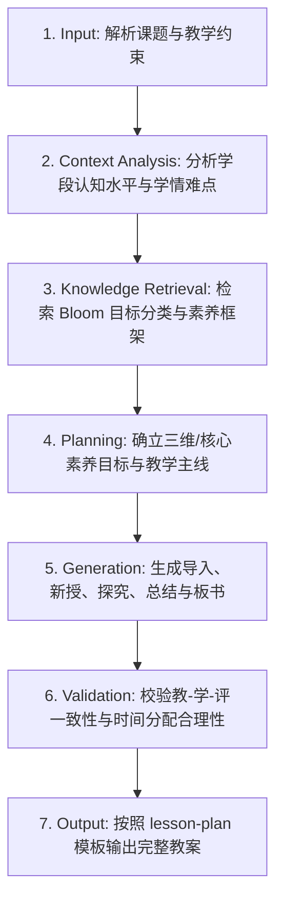

# 通用教学设计 (Lesson Design)

## 1. 技能概述 (Description & Purpose)
本技能负责根据给定的教学主题、目标受众与课时安排，生成结构严谨、素养导向、教-学-评一体化的标准教学设计方案。

## 2. 适用边界 (When to use / When NOT to use)
- **何时使用**：
  - 需要从零规划一节新授课、复习课或探究课的完整教学方案时。
  - 需要梳理教材分析、学情分析、教学目标与活动链条时。
- **何时不使用**：
  - 单纯需要命制一套测试卷或作业题时（建议使用 `core.assessment-design`）。
  - 单纯需要设计复杂工程项目时（建议使用 `core.project-learning`）。

## 3. 输入与约束 (Inputs & Constraints)
- **输入参数**：
  - `topic`: 教学主题
  - `grade_level`: 学段年级
  - `duration`: 课时时长（如 40 或 45 分钟）
  - `student_prior_knowledge`: 学生前概念与知识基础
  - `teaching_environment`: 教学环境（如多媒体教室、机房、创客实验室）
- **教学约束**：
  - 教学目标必须包含素养维度与行为动词，严禁使用“使学生掌握”等笼统表述。
  - 必须体现以学生为主体的探究活动，教师讲授时间通常不超过总课时的 40%。

## 4. 标准执行工作流 (Workflow)

### 环节详解：
1. **Input**：解析传入的课题、课时与教学环境约束。
2. **Context Analysis**：分析目标学段学生的心理认知特点，定位本节课的认知跃迁点。
3. **Knowledge Retrieval**：调取布鲁姆认知目标分类法与课程标准核心素养描述词。
4. **Planning**：确定教学重点、难点，构建驱动性主问题与层级化学习任务。
5. **Generation**：输出结构化教学过程（环节目标、教师活动、学生活动、设计意图、预设反馈）。
6. **Validation**：检查教学目标是否能在评价环节闭环检测，检查活动时长总和是否匹配。
7. **Output**：注入 `templates/lesson-plan/lesson-plan.md` 输出 Markdown 文本。

## 5. 质量评估基准 (Quality Criteria)
- [ ] **目标明确性**：教学目标符合 SMART 原则，采用清晰行为动词。
- [ ] **重难点突破**：针对教学难点设计了递进式脚手架或探究支架。
- [ ] **主体性**：学生活动具体可操作，包含思考、表达、动手或协作过程。
- [ ] **评价对齐**：每个关键教学环节均包含对应的形成性评价观察点。

## 6. 关联资源与产物 (Dependencies & Outputs)
- **关联模板**：`templates/lesson-plan/lesson-plan.md`
- **关联知识**：`knowledge/common/pedagogy/bloom-taxonomy.md`
