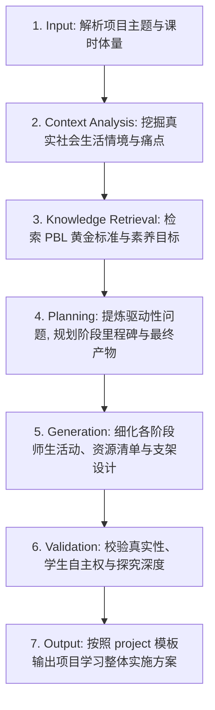

# 通用项目式学习设计 (Project-Based Learning Design)

## 1. 技能概述 (Description & Purpose)
本技能负责设计基于真实世界情境（Authentic Context）的长周期或中周期项目式学习（PBL）方案，提炼驱动性问题（Driving Question），规划里程碑阶段与公开展示成果。

## 2. 适用边界 (When to use / When NOT to use)
- **何时使用**：
  - 需要设计跨课时的大单元教学、学期跨学科综合实践项目时。
  - 需要学生团队合作完成公开制品（Public Product）时。
- **何时不使用**：
  - 仅设计单一课时的微小随堂练习或基础概念讲授时。

## 3. 输入与约束 (Inputs & Constraints)
- **输入参数**：
  - `project_theme`: 项目大主题（如“未来社区节能改造”、“校园文化文创产品设计”）
  - `total_periods`: 总课时量（如 4-8 课时）
  - `target_grades`: 目标学段
  - `interdisciplinary_links`: 关联跨学科领域（如科学、美术、信息、语文）
- **教学约束**：
  - 必须包含具有开放性、挑战性且与学生生活紧密相连的“驱动性问题”。
  - 必须划分清晰的阶段性里程碑（Milestones）与形成性检查点（Checkpoints）。

## 4. 标准执行工作流 (Workflow)

### 环节详解：
1. **Input**：确定项目主题、跨学科关联及可用资源。
2. **Context Analysis**：找准学生生活痛点，确保项目具备真实意义而非虚拟命题。
3. **Knowledge Retrieval**：检索 PBL 核心要素（黄金标准 PBL 理论）。
4. **Planning**：提炼驱动性问题（Driving Question），拆分入项、探究制作、迭代优化、成果展示四个阶段。
5. **Generation**：输出项目任务书、阶段学习支架、专家介入契机与展示答辩规则。
6. **Validation**：检查学生在项目过程中是否拥有充分的发言权与选择权（Voice & Choice）。
7. **Output**：注入 `templates/project/project-proposal.md` 输出 Markdown 文本。

## 5. 质量评估基准 (Quality Criteria)
- [ ] **真实性 (Authenticity)**：驱动性问题源于现实世界，产物面向真实受众。
- [ ] **持续探究 (Sustained Inquiry)**：包含多轮提出假设、搜集证据、制作改进的过程。
- [ ] **公开展示 (Public Product)**：包含面向家长、社区或校内的公开成果汇报机制。

## 6. 关联资源与产物 (Dependencies & Outputs)
- **关联模板**：`templates/project/project-proposal.md`
- **关联知识**：`knowledge/common/curriculum/core-competencies-framework.md`
