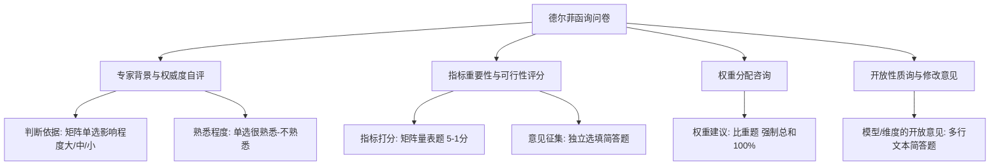

# 德尔菲法（Delphi）问卷设计与数据统计 SOP

本指南总结了德尔菲法专家函询问卷在线化转型的标准范式，涵盖题目设计、移动端适配与统计指标处理。

---

## 1. 德尔菲函询问卷核心结构与题型转换

德尔菲法问卷通常包含以下四部分，在线化时须遵循如下转换原则：

### 1.1 专家权威程度自评 ($C_r$)
- **组成**：专家权威系数由两个维度决定：$C_r = \frac{C_a + C_s}{2}$
  - $C_a$（判断依据系数）：包括理论分析、实践经验、同行了解、直觉等，在线转换为 **`[矩阵题]`**（单选矩阵，选项为：影响大、影响中、影响小）。
  - $C_s$（熟悉程度系数）：专家对该领域的熟悉程度，在线转换为 **单选题**（很熟悉=1.0，比较熟悉=0.8，一般=0.6，不太熟悉=0.4，不熟悉=0.2）。
- **目的**：筛选与加权专家群体，一般要求专家群体权威程度 $C_r \ge 0.70$。

### 1.2 指标评分与修改意见解耦（重要适配）
- **传统表格痛点**：传统 Word 问卷中，每项指标右侧有“修改意见”列。在问卷星等移动端工具中，二维表格无法嵌套自由文本输入框。
- **标准化解决方案**：
  - 将同维度指标整体打包为道 **`[矩阵量表题]`**（以 1-5 分打分）；
  - 紧跟一道 **选填简答题**：“该维度指标修改或增删建议（选填）”。
  - **优势**：
    1. 移动端可开启“矩阵题单题作答模式”，每道指标滑动即可评分，体验极其流畅；
    2. 只有少数专家对个别指标有具体修改建议，集中填写选填简答题更符合填写习惯。

### 1.3 权重分配（比重题）
- **痛点**：纸质或 Word 填报时，专家常出现各维度权重相加不等于 100% 的低级错误。
- **解决方案**：采用问卷星 **`[比重题]`**，在后台勾选“各项总和必须等于 100%”，系统自动实时计算并强制校验。

---

## 2. 问卷星数据导出与德尔菲指标量化筛选

第一轮函询回收后，从问卷星下载原始数据（Excel/SPSS），按以下指标进行统计分析与指标筛选：

### 2.1 统计指标计算公式
1. **算术均值（Mean, $\overline{X_j}$）**：
   $$\overline{X_j} = \frac{1}{N} \sum_{i=1}^{N} X_{ij}$$
   反映专家对指标 $j$ 重要性的集中倾向。
2. **标准差（Standard Deviation, $S_j$）**：
   $$S_j = \sqrt{\frac{1}{N-1} \sum_{i=1}^{N} (X_{ij} - \overline{X_j})^2}$$
   反映专家评分的离散程度。
3. **变异系数（Coefficient of Variation, $CV_j$）**：
   $$CV_j = \frac{S_j}{\overline{X_j}}$$
   反映专家对指标 $j$ 认识的分歧程度。$CV$ 越小，说明专家协调度越高。

### 2.2 德尔菲指标筛选门槛（通则）
- **重要性保留门槛**：$\overline{X} \ge 4.0$（或满分 5 分的 80% 以上）。
- **协调度门槛**：$CV \le 0.25$。
- **淘汰或修改规则**：
  - 若 $\overline{X} < 3.5$ 且 $CV > 0.25$，直接予以删除；
  - 若 $3.5 \le \overline{X} < 4.0$ 或 $CV > 0.25$，结合专家的定性修改意见综合研判，进行合并、重构或进入第二轮函询重点论证。
