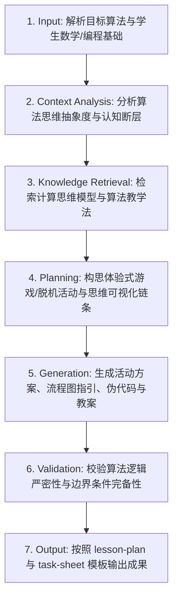

# 算法与计算思维教学 (Algorithm Lesson Design)

## 1. 技能概述 (Description & Purpose)
本技能负责中小学算法类知识点（如穷举法、二分查找、冒泡排序、选择排序、递归与分治等）的教学设计，强调算法原理的具象化感知（Unplugged 活动、物理模拟）、算法思维的抽象表达（流程图、伪代码）以及算法效率与复杂度的直观对比。

## 2. 适用边界 (When to use / When NOT to use)
- **何时使用**：
  - 开展查找、排序、贪心、动态规划等经典算法原理教学时。
  - 需要帮助学生从具体生活问题中抽象出计算模型与算法逻辑时。
- **何时不使用**：
  - 纯语法讲授（如基本输入输出）时（请使用 `it.programming`）。

## 3. 输入与约束 (Inputs & Constraints)
- **输入参数**：
  - `algorithm_name`: 算法名称（如折半查找 / 冒泡排序）
  - `visual_or_unplugged_activity`: 是否包含无电脑脱机活动（Unplugged）
  - `data_scale_contrast`: 是否进行大规模数据效率对比演示
- **教学约束**：
  - 严禁一上来就贴出几十行算法代码；必须经历“生活情境感知 ➔ 手动模拟演示 ➔ 算法逻辑抽象 ➔ 流程图/伪代码 ➔ 编程实现”的完整认知过程。
  - 必须强调算法的前置条件（如二分查找必须在有序数组中进行）。

## 4. 标准执行工作流 (Workflow)

### 环节详解：
1. **Input**：接收算法名称、学段目标与课时要求。
2. **Context Analysis**：分析学生理解算法的困难点（如指针移动逻辑、嵌套循环中的内外层意义）。
3. **Knowledge Retrieval**：检索信息科技课标中关于“算法特征、算法描述、算法效率”的评价指标。
4. **Planning**：设计破冰游戏（如猜扑克牌、排队比身高）、手动追踪表与思维导图。
5. **Generation**：输出教学设计、算法流程图描述、伪代码、Python 实现对比及复杂度拓展讨论。
6. **Validation**：确保边界条件说明完整（如空列表、单元素、查找目标不存在等边缘情况）。
7. **Output**：生成教案与配套学习任务单。

## 5. 质量评估基准 (Quality Criteria)
- [ ] **直观具象**：配有扑克牌、天平称重或数字卡片等具象化操作引导。
- [ ] **逻辑严谨**：流程图与伪代码无逻辑漏洞，指针边界明确。
- [ ] **效率意识**：通过比较不同算法在不同规模输入下的执行步数，树立时间/空间优化意识。

## 6. 关联资源与产物 (Dependencies & Outputs)
- **依赖技能**：`core.lesson-design`, `core.activity-design`
- **关联模板**：`templates/lesson-plan/lesson-plan.md`, `templates/task-sheet/task-sheet.md`
- **关联知识**：`knowledge/information-technology/discipline/computational-thinking-dimensions.md`
