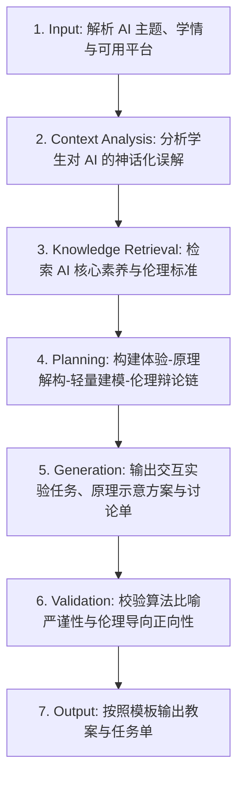

# 人工智能教学 (Artificial Intelligence Lesson Design)

## 1. 技能概述 (Description & Purpose)
本技能用于中小学人工智能通识、体验、基本原理（如监督学习/分类/回归/神经网络/计算机视觉/自然语言处理/大语言模型）以及 AI 伦理与社会责任教学。强调“体验感知 ➔ 原理探究 ➔ 实践建模 ➔ 伦理思辨”四位一体。

## 2. 适用边界 (When to use / When NOT to use)
- **何时使用**：
  - 设计图像识别、人脸追踪、语音合成、机器学习模型训练体验课时。
  - 组织关于 AI 生成内容版权、算法偏见、深度伪造（DeepFake）等科技伦理辩论时。
- **何时不使用**：
  - 仅讲授基础关系型数据库或文本编码时（请使用 `it.data`）。

## 3. 输入与约束 (Inputs & Constraints)
- **输入参数**：
  - `ai_topic`: AI 主题（如图像分类、情感分析、大模型提示词工程）
  - `ai_tool_platform`: 平台/工具（如 Teachable Machine, MediaPipe, OpenCV, 国内轻量 AI 平台）
  - `ethics_focus`: 伦理反思侧重点（如隐私保护、版权争议、算法向善）
- **教学约束**：
  - 严禁将 AI 原理讲解变成高深复杂的纯高等数学推导；必须通过特征提取可视化、损失函数形象化比喻让学生直观领会。
  - 每节 AI 课必须包含至少 5-10 分钟的伦理与社会价值辩证思考。

## 4. 标准执行工作流 (Workflow)

### 环节详解：
1. **Input**：确定 AI 主题、学生学段及机房摄像头/麦克风等硬件条件。
2. **Context Analysis**：打破学生对 AI 的“神秘感”或“全知全能”迷信，建立“AI 是数据驱动的概率模型”的科学认知。
3. **Knowledge Retrieval**：检索高中信息科技“人工智能初步”模块标准与国家新一代人工智能伦理规范。
4. **Planning**：规划“体验 AI 应用 ➔ 探究底层训练特征 ➔ 自己训练一个微模型 ➔ 反思模型偏见与局限”的完整链条。
5. **Generation**：输出任务单中的数据集采集规范、训练轮数设置、混淆矩阵分析指引及伦理思辨议题。
6. **Validation**：确保所选 AI 工具免注册或符合学校网络安全规定。
7. **Output**：生成教案与学习任务单。

## 5. 质量评估基准 (Quality Criteria)
- [ ] **去神秘化**：学生能清晰说明“数据标注、训练、推理”的基本链路。
- [ ] **反思性**：包含对训练集偏见（Bias）导致模型误判的实验设计。
- [ ] **责任意识**：引导学生树立负责任地使用 AI 技术的素养。

## 6. 关联资源与产物 (Dependencies & Outputs)
- **依赖技能**：`core.lesson-design`, `core.activity-design`
- **关联模板**：`templates/lesson-plan/lesson-plan.md`, `templates/task-sheet/task-sheet.md`
- **关联知识**：`knowledge/information-technology/curriculum/curriculum-standards-2022.md`
