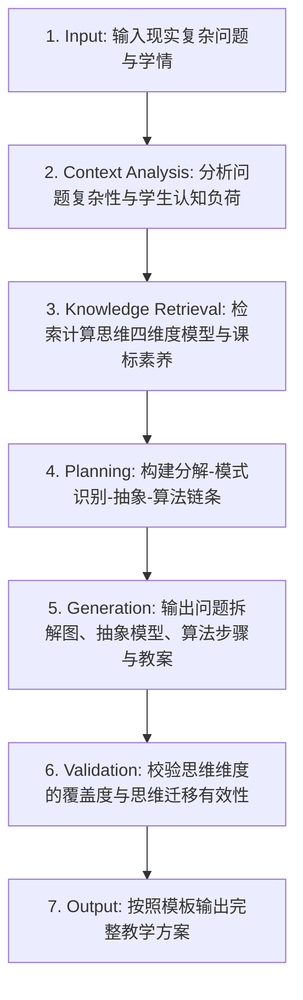

# 计算思维培养 (Computational Thinking Development)

## 1. 技能概述 (Description & Purpose)
本技能聚焦于系统培养信息科技核心素养之“计算思维（Computational Thinking）”，通过四维模型——**问题分解（Decomposition）、模式识别（Pattern Recognition）、抽象建模（Abstraction）与算法设计（Algorithm Design）**，将计算思维外化为可操作、可观察的学生认知活动。

## 2. 适用边界 (When to use / When NOT to use)
- **何时使用**：
  - 需要在各类信息科技课程中强化计算思维训练，引导学生从形式化走向思维内化时。
  - 设计无电脑计算思维游戏（Bebras 国际计算思维挑战赛题目转化）时。
- **何时不使用**：
  - 纯物理工程制作课（请使用技术与工程类技能）。

## 3. 输入与约束 (Inputs & Constraints)
- **输入参数**：
  - `problem_scenario`: 待解决的复杂生活或跨学科问题（如“设计最优校园快递配送路线”）
  - `target_ct_dimension`: 重点聚焦的计算思维维度（如侧重“分解与抽象”或“模式匹配”）
- **教学约束**：
  - 必须显式标注每个教学环节对应的计算思维子维度。
  - 必须引导学生反思“该思维方法如何迁移应用到其他非计算机领域”。

## 4. 标准执行工作流 (Workflow)

### 环节详解：
1. **Input**：接收复杂生活问题情境。
2. **Context Analysis**：评估直接求解的困难，规划思维支架。
3. **Knowledge Retrieval**：检索计算思维专业认知量表与学业质量分级。
4. **Planning**：
   - 分解：将大问题拆解为独立子问题模块。
   - 模式识别：寻找历史相似经验或规律。
   - 抽象：剔除无关干扰信息，提炼数学/数据模型。
   - 算法设计：编写确定的有限步骤解决方案。
5. **Generation**：输出任务单中的思维导图模板、形式化表征卡片与思维反思问题。
6. **Validation**：检查各思维环节是否层层递进，是否形成了认知闭环。
7. **Output**：生成教案与学习任务单。

## 5. 质量评估基准 (Quality Criteria)
- [ ] **维度显性化**：教案明确标注（分解/模式/抽象/算法）思维符号。
- [ ] **可迁移性**：包含至少 1 个生活/学科迁移应用案例。

## 6. 关联资源与产物 (Dependencies & Outputs)
- **依赖技能**：`core.lesson-design`, `core.activity-design`
- **关联模板**：`templates/lesson-plan/lesson-plan.md`, `templates/task-sheet/task-sheet.md`
- **关联知识**：`knowledge/information-technology/discipline/computational-thinking-dimensions.md`
