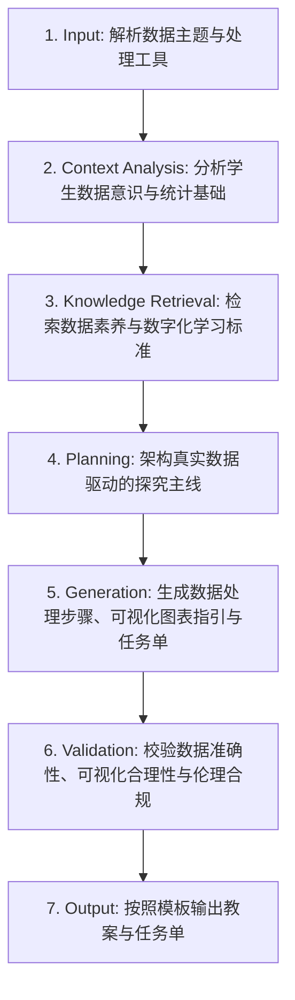

# 数据与数据处理教学 (Data and Data Processing Design)

## 1. 技能概述 (Description & Purpose)
本技能用于“数据、信息与知识”、“数据编码（文本/图像/音频编码）”、“数据采集与清洗”、“数据可视化与分析”等单元的教学设计。强调从数据中发现价值、培养数据敏感性与数据安全意识。

## 2. 适用边界 (When to use / When NOT to use)
- **何时使用**：
  - 开展字符编码（ASCII, Unicode）、多媒体数字化采样、Excel/Pandas 数据分析与图表生成教学时。
  - 需要引导学生从真实数据集中提炼趋势与规律时。
- **何时不使用**：
  - 纯机器学习模型训练与调参教学时（请使用 `it.artificial-intelligence`）。

## 3. 输入与约束 (Inputs & Constraints)
- **输入参数**：
  - `data_topic`: 数据主题（如“全国空气质量指数数据分析” / “黑白点阵图像二进制编码”）
  - `data_tool`: 工具（Python Pandas/Matplotlib, Excel, 纯手工纸质编码卡）
  - `dataset_description`: 数据集规模与特征
- **教学约束**：
  - 数据必须具有真实性和生活相关性，严禁使用脱离现实的纯数字虚拟矩阵。
  - 必须包含数据伦理与个人隐私保护讨论。

## 4. 标准执行工作流 (Workflow)

### 环节详解：
1. **Input**：接收数据主题、数据处理软件环境及教学目标。
2. **Context Analysis**：分析学生对数据价值的感知水平（从直觉判断到证据导向）。
3. **Knowledge Retrieval**：检索信息科技课标中关于数据意识与信息社会责任的学业要求。
4. **Planning**：设计数据采集、清洗、统计分析、图表呈现、结论推导与伦理反思五个环节。
5. **Generation**：输出任务单指引（含数据字典、清洗公式/代码、可视化选型指引）。
6. **Validation**：确保所用图表类型（折线图、柱状图、饼图、散点图）符合数据特征表达规范。
7. **Output**：生成教案与学习任务单。

## 5. 质量评估基准 (Quality Criteria)
- [ ] **真实数据源**：提供可实际下载或使用的样例数据集片段。
- [ ] **图表得当性**：引导学生根据自变量与因变量特征选择恰当的图表类型。
- [ ] **素养升华**：引导学生理解从“数据”到“信息”，再到“知识与智慧”的建构历程。

## 6. 关联资源与产物 (Dependencies & Outputs)
- **依赖技能**：`core.lesson-design`, `core.activity-design`
- **关联模板**：`templates/lesson-plan/lesson-plan.md`, `templates/task-sheet/task-sheet.md`
- **关联知识**：`knowledge/information-technology/curriculum/curriculum-standards-2022.md`
