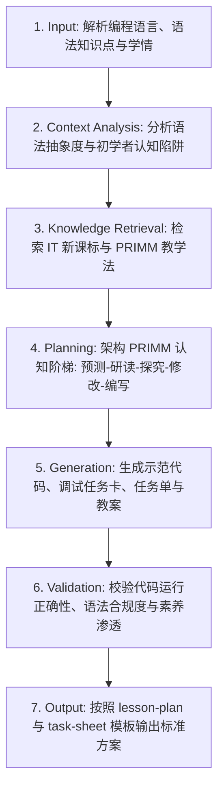

# 编程教学设计 (Programming Lesson Design)

## 1. 技能概述 (Description & Purpose)
本技能专门用于中小学程序设计（如 Python、C++、图形化编程等）教学设计。通过应用国际公认的编程教学模型（如 PRIMM 教学法：Predict-Read-Investigate-Modify-Make、Parson 代码块重排拼题、阶梯式脚手架与报错调试支架），降低学生认知负荷，培养真实编程问题解决能力与调试排错素养。

## 2. 适用边界 (When to use / When NOT to use)
- **何时使用**：
  - 教授变量、分支、循环、函数、列表、字典、面向对象等编程语法与应用时。
  - 需要为学生提供代码阅读、代码填空、报错调试与综合编程任务时。
- **何时不使用**：
  - 纯粹探讨算法复杂度理论或数学归纳证明时（请使用 `it.algorithm`）。
  - 设计纯硬件搭建或机械加工活动时（请使用技术与工程类技能）。

## 3. 输入与约束 (Inputs & Constraints)
- **输入参数**：
  - `programming_language`: 编程语言（如 Python 3, C++, Scratch）
  - `target_construct`: 目标语法与控制结构（如 `for` 循环与 `range()` 函数）
  - `real_world_context`: 贴近学生生活的真实情境（如“班级点名器”、“自动计费系统”）
  - `ide_environment`: 运行环境（IDLE, Jupyter, VS Code, 在线平台）
- **教学约束**：
  - **严禁直接让零基础学生从白板直接敲代码（Blank Page Syndrome）**；必须严格遵循“先读代码/预测输出（Predict/Read） ➔ 探究修改（Investigate/Modify） ➔ 独立创作（Make）”的认知阶梯。
  - 必须提供“常见报错类型清单（SyntaxError, IndexError, TypeError）”及排错支架。

## 4. 标准执行工作流 (Workflow)

### 环节详解：
1. **Input**：接收编程知识点、学生水平及所用编程工具环境。
2. **Context Analysis**：分析目标语法对初学者的隐性门槛（例如缩进敏感、变量作用域、索引越界）。
3. **Knowledge Retrieval**：调取课标中关于“计算思维”与“数字化学习与创新”的学业质量标准，以及 PRIMM 教学模型。
4. **Planning**：基于 `core.lesson-design` 与 `core.activity-design` 构建课堂主线，规划代码阶梯。
5. **Generation**：输出完整教案、学生任务单中的范例代码（含详细行级注释）、挖空修改任务、找错调试任务与自主创造题。
6. **Validation**：确保所有示例代码在标准解释器中能无错误运行，且符合 PEP 8 等行业编码规范。
7. **Output**：注入模板产出教案与学习任务单。

## 5. 质量评估基准 (Quality Criteria)
- [ ] **代码可靠性**：所有提供的代码示例语法准确、逻辑严密、无未捕获异常。
- [ ] **脚手架梯度**：从半成品代码修改平滑过渡到自主编写，降低初学者挫败感。
- [ ] **调试素养**：包含指导学生观察错误提示信息、利用 print 单步追踪排错的环节。

## 6. 关联资源与产物 (Dependencies & Outputs)
- **依赖技能**：`core.lesson-design`, `core.activity-design`, `core.assessment-design`
- **关联模板**：`templates/lesson-plan/lesson-plan.md`, `templates/task-sheet/task-sheet.md`
- **关联知识**：`knowledge/information-technology/curriculum/curriculum-standards-2022.md`, `knowledge/information-technology/pedagogy/programming-pedagogy-primm.md`
