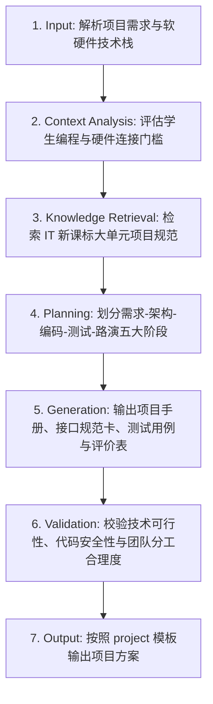

# 信息科技项目学习 (IT Project-Based Learning)

## 1. 技能概述 (Description & Purpose)
本技能继承通用项目式学习能力 `core.project-learning`，专门用于信息科技学科的大单元项目化教学（如“基于物联网的智慧农场监控系统开发”、“班级错题本管理系统软件开发”等）。重点融入轻量级软件工程规范（需求分析、架构设计、模块划分、协同编码、单元测试、版本迭代）。

## 2. 适用边界 (When to use / When NOT to use)
- **何时使用**：
  - 高中信息科技选择性必修模块大单元项目、初中信息科技跨学科主题大项目开发时。
  - 需要组织学生小组进行软硬件一体化开发或网页/App 原型制作时。
- **何时不使用**：
  - 纯机械结构与材料加工项目（请使用 `te.project-learning`）。

## 3. 输入与约束 (Inputs & Constraints)
- **输入参数**：
  - `project_name`: 项目名称
  - `system_architecture`: 涉及的软硬件栈（如 Micro:bit/ESP32 + MQTT + Python Flask + SQLite）
  - `project_periods`: 课时安排（通常 4-8 课时）
- **教学约束**：
  - 必须包含软件工程生命周期中的“需求定义表”、“数据流图/接口设计”与“功能验收测试用例”。

## 4. 标准执行工作流 (Workflow)

### 环节详解：
1. **Input**：确定项目命题与技术方案。
2. **Context Analysis**：识别团队协作中的技术难点（如通信协议配置、接口不匹配）。
3. **Knowledge Retrieval**：调取课标关于“数字化学习与创新”项目评价量规。
4. **Planning**：基于 `core.project-learning` 规划课时推进表与工程里程碑。
5. **Generation**：输出任务书、模块分工清单、数据接口协议与测试清单。
6. **Validation**：确保技术选型符合中小学教学实验室环境。
7. **Output**：注入项目模板输出。

## 5. 质量评估基准 (Quality Criteria)
- [ ] **系统完整性**：兼具输入、处理、输出与持久化存储完整链路。
- [ ] **团队协同**：模块接口定义清晰，支持组内并行开发与集成联调。

## 6. 关联资源与产物 (Dependencies & Outputs)
- **依赖技能**：`core.project-learning`, `core.activity-design`, `core.assessment-design`
- **关联模板**：`templates/project/project-proposal.md`
- **关联知识**：`knowledge/information-technology/curriculum/curriculum-standards-2022.md`
