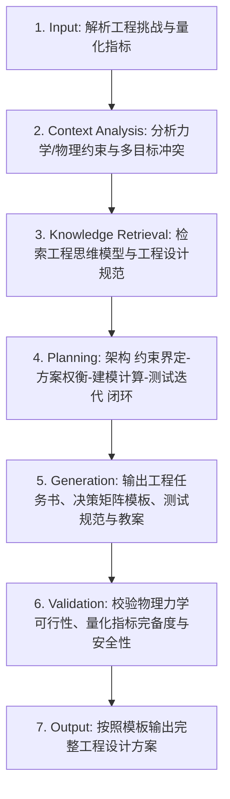

# 工程设计与权衡决策 (Engineering Design Process)

## 1. 技能概述 (Description & Purpose)
本技能基于真实世界工程挑战，组织学生体验标准“工程设计过程（Engineering Design Process - EDP）”：**界定工程问题 ➔ 调研约束与标准 ➔ 头脑风暴方案 ➔ 权衡矩阵决策 ➔ 详细工程建模 ➔ 样机制造 ➔ 技术测试 ➔ 数据分析 ➔ 方案迭代**。特别强调成本控制、安全冗余、环境影响与多目标冲突下的工程权衡思维。

## 2. 适用边界 (When to use / When NOT to use)
- **何时使用**：
  - 进行复杂工程命题（如“抗震塔台结构”、“跨度承重纸桥”、“风力发电机叶片气动优化”）教学设计时。
  - 需要培养学生面对多目标冲突（如兼顾“极轻自重”与“极高承重”）做出理性妥协决策时。
- **何时不使用**：
  - 纯手工工艺模仿（无量化指标与权衡优化）时（请使用 `te.technical-practice`）。

## 3. 输入与约束 (Inputs & Constraints)
- **输入参数**：
  - `engineering_challenge`: 工程挑战命题（如“500g 极限材料承重 20kg 桁架桥”）
  - `budget_and_material_limits`: 成本、重量、尺寸与安全硬约束
  - `quantifiable_metrics`: 量化评估指标（如承重自重比、效率值、抗震烈度）
- **教学约束**：
  - 必须包含量化的“工程决策矩阵（Decision Matrix / Pugh Matrix）”。
  - 必须引导学生经历至少一次由于测试失败而触发的根因分析与方案再设计。

## 4. 标准执行工作流 (Workflow)

### 环节详解：
1. **Input**：接收工程任务、限制条件及量化测试方案。
2. **Context Analysis**：识别强度与成本、轻量化与刚度之间的工程矛盾点。
3. **Knowledge Retrieval**：检索普通高中通用技术课标中“工程思维”素养要求。
4. **Planning**：确定量化评估公式、决策打分权重与迭代测试里程碑。
5. **Generation**：输出任务单中的工程计算草稿页、Pugh 决策打分表、应力集中区标记图。
6. **Validation**：检查安全防护措施是否完备（如防碎屑护目镜、破损飞溅防护）。
7. **Output**：生成教案与学习任务单。

## 5. 质量评估基准 (Quality Criteria)
- [ ] **量化指标明确**：包含可精确测量的工程效能比公式。
- [ ] **权衡显性化**：学生能运用加权打分表阐述为什么放弃方案 A 而选择方案 B。
- [ ] **失效应急**：包含测试破坏时的断口与失效分析（Failure Analysis）指导。

## 6. 关联资源与产物 (Dependencies & Outputs)
- **依赖技能**：`core.lesson-design`, `core.activity-design`
- **关联模板**：`templates/lesson-plan/lesson-plan.md`, `templates/task-sheet/task-sheet.md`
- **关联知识**：`knowledge/technology-engineering/discipline/engineering-thinking-process.md`, `knowledge/technology-engineering/pedagogy/engineering-design-loop.md`
