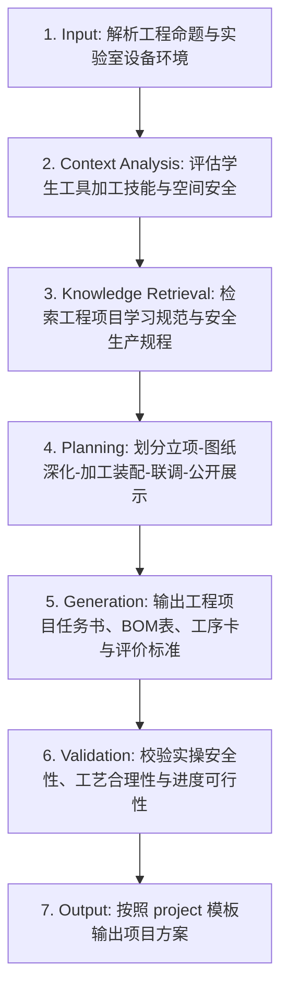

# 技术与工程项目学习 (Technology & Engineering Project-Based Learning)

## 1. 技能概述 (Description & Purpose)
本技能继承通用项目式学习能力 `core.project-learning`，专门用于技术与工程学科的大单元综合工程项目（如“校园无障碍坡道与自动升降装置设计制作”、“微型生态智能温室工程”、“风光互补路灯模型制作”）。强化实物产品全生命周期研发管理（从需求定义、图纸深化、物料采购预算、机械电气加工装配到整机综合联调与答辩）。

## 2. 适用边界 (When to use / When NOT to use)
- **何时使用**：
  - 高中通用技术选择性必修模块大项目（电子控制技术、机器人设计与制作、现代农业技术等）。
  - 需要组织学生跨多周完成实体工程样机制作与现场路演答辩时。
- **何时不使用**：
  - 纯虚拟软件开发或网页设计项目（请使用 `it.project-learning`）。

## 3. 输入与约束 (Inputs & Constraints)
- **输入参数**：
  - `project_name`: 工程项目主题
  - `physical_hardware_scope`: 实物硬件与加工工艺范围（木工/金工/3D打印/激光切割/电子电路）
  - `project_milestones_count`: 项目阶段课时数（通常 6-10 课时）
- **教学约束**：
  - 必须包含严密的“创客空间/通用技术实验室安全生产与工具操作规程（SOP）”。
  - 必须包含实体 BOM（物料清单）与成本核算表。

## 4. 标准执行工作流 (Workflow)

### 环节详解：
1. **Input**：确定工程项目主题、场地工具与材料支持条件。
2. **Context Analysis**：识别加工中的安全隐患（如电烙铁烫伤、旋转工具卷入）并设计防护支架。
3. **Knowledge Retrieval**：检索高中通用技术课标中关于“物化能力”与“工匠精神”的要求。
4. **Planning**：基于 `core.project-learning` 规划立项开题、工艺规划、部件制作、系统总装、验收测试与成果发布。
5. **Generation**：输出任务单中的工具使用指导卡、装配工序流程图、BOM 物料预算表。
6. **Validation**：确保有明确的指导教师安全巡视与急救预案。
7. **Output**：注入项目模板输出。

## 5. 质量评估基准 (Quality Criteria)
- [ ] **安全第一**：安全规范条目清晰，列入开工准入考核。
- [ ] **工程物化**：产物为可实际运转、具备物理交互功能的工程实体样机。

## 6. 关联资源与产物 (Dependencies & Outputs)
- **依赖技能**：`core.project-learning`, `core.activity-design`, `core.assessment-design`
- **关联模板**：`templates/project/project-proposal.md`
- **关联知识**：`knowledge/technology-engineering/curriculum/general-technology-standards.md`
