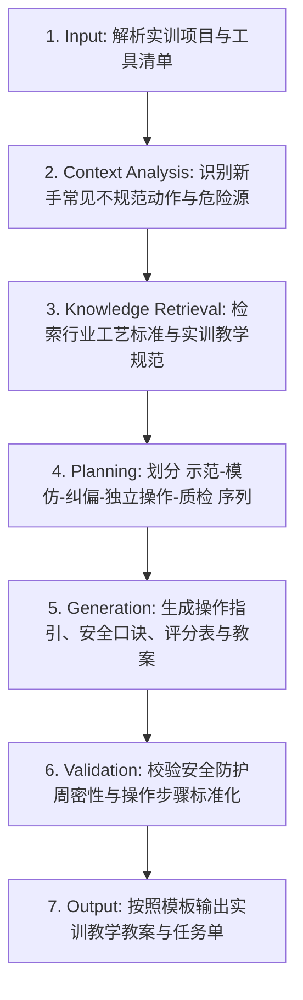

# 技术实践与工艺实训 (Technical Practice & Craftsmanship)

## 1. 技能概述 (Description & Purpose)
本技能用于技术与工程课程中**基础工艺实操与劳动技术技能实训**（如传统木工榫卯、金工锯锉加工、电子焊接与电路组装、简易机械调校）。注重劳动工具的正确使用规范、劳动习惯养成、工匠精神熏陶与物化能力沉淀。

## 2. 适用边界 (When to use / When NOT to use)
- **何时使用**：
  - 开展“手锯使用与锯割姿势”、“锉刀平锉与交叉锉”、“电烙铁手工五步焊接法”、“万用表检测电路”等实训课时。
  - 需要制定细致的工艺操作评分表与工件质量检验规程时。
- **何时不使用**：
  - 纯粹探讨算法逻辑或编程语言课时。

## 3. 输入与约束 (Inputs & Constraints)
- **输入参数**：
  - `practice_skill`: 实训技能名称（如“手工电烙铁五步焊接”、“木工燕尾榫制作”）
  - `tools_and_equipment`: 使用的工具与耗材
  - `inspection_standard`: 工件精度与验收技术要求（如焊点圆润光亮无虚焊、榫卯严丝合缝）
- **教学约束**：
  - 必须包含严禁触犯的“车间/实验室安全操作红线”。
  - 必须提供“正确动作姿势 vs 错误操作动作”图文对照指引。

## 4. 标准执行工作流 (Workflow)

### 环节详解：
1. **Input**：接收实训主题与工艺检验标准。
2. **Context Analysis**：识别易伤手、易烫伤、易损坏工具的薄弱操作节点。
3. **Knowledge Retrieval**：调取职业技能实训标准与工匠素养评价指标。
4. **Planning**：遵循“教师动作精讲示范 ➔ 学生徒手空练 ➔ 带料操作 ➔ 巡回个别纠偏 ➔ 工件互评互检”教学模式。
5. **Generation**：输出任务单中的操作口诀、安全自查确认勾选框、工件尺寸精度测量表。
6. **Validation**：检查个人防护装备（PPE）佩戴要求是否明确。
7. **Output**：生成教案与实训任务单。

## 5. 质量评估基准 (Quality Criteria)
- [ ] **动作要领口诀化**：关键动作提炼为朗朗上口、易记易查的口诀。
- [ ] **质量可量化**：包含可客观量测的几何精度或电气连通性指标。

## 6. 关联资源与产物 (Dependencies & Outputs)
- **依赖技能**：`core.lesson-design`, `core.activity-design`
- **关联模板**：`templates/lesson-plan/lesson-plan.md`, `templates/task-sheet/task-sheet.md`
- **关联知识**：`knowledge/technology-engineering/curriculum/general-technology-standards.md`
