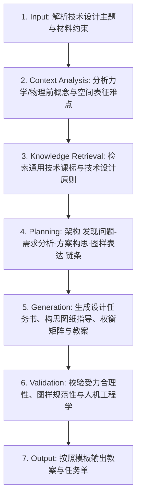

# 技术设计基础教学 (Technology Design Lesson Design)

## 1. 技能概述 (Description & Purpose)
本技能用于普通高中通用技术/初中劳动与技术中“技术设计基础”主题的教学设计，涵盖**结构与设计（稳定性/强度/连接方式）、流程与设计（时序与环节/流程优化）、系统与设计（整体性/相关性/环境适应性）、控制与设计（开环/闭环/干扰因素）**等核心模块。

## 2. 适用边界 (When to use / When NOT to use)
- **何时使用**：
  - 进行结构受力分析、草图绘制与尺寸标注、控制系统框图绘制教学时。
  - 引导学生理解技术设计的原则（科学性、实用性、创新性、安全性、经济性、美观性）时。
- **何时不使用**：
  - 纯软件编程课（请使用 `it.programming`）。

## 3. 输入与约束 (Inputs & Constraints)
- **输入参数**：
  - `design_topic`: 技术设计主题（如“便携式多功能台灯结构设计”、“自动恒温水箱控制系统设计”）
  - `design_domain`: 技术领域（结构 / 流程 / 系统 / 控制）
  - `material_constraints`: 材料与工艺限制（如厚纸板、亚克力、PVC管、继电器）
- **教学约束**：
  - 必须包含标准“技术图样表达（草图/透视图/三视图/尺寸标注）”或“控制系统方框图”环节。
  - 必须引导学生进行“多方案比较与权衡（Trade-off）”，严禁唯一绝对答案。

## 4. 标准执行工作流 (Workflow)

### 环节详解：
1. **Input**：接收设计命题、适用对象与材料加工条件。
2. **Context Analysis**：分析学生在三维空间想象、受力受弯分析上的认知难点。
3. **Knowledge Retrieval**：检索通用技术学科核心素养（技术意识、工程思维、图样表达、物化能力）。
4. **Planning**：确定发现生活痛点 ➔ 明确设计限制 ➔ 方案头脑风暴 ➔ 方案权衡决策 ➔ 绘制草图并标注尺寸。
5. **Generation**：输出任务单中的设计限制清单、草图绘制网格区、人机关系分析表及方案打分矩阵。
6. **Validation**：检查是否考虑了人机工程学舒适度与人身安全。
7. **Output**：生成教案与学习任务单。

## 5. 质量评估基准 (Quality Criteria)
- [ ] **图样规范**：包含三视图投影规律（长对正、高平齐、宽相等）或徒手草图规范。
- [ ] **方案多样性**：要求学生至少构思 2 种以上差异化方案并进行优缺点比对。

## 6. 关联资源与产物 (Dependencies & Outputs)
- **依赖技能**：`core.lesson-design`, `core.activity-design`
- **关联模板**：`templates/lesson-plan/lesson-plan.md`, `templates/task-sheet/task-sheet.md`
- **关联知识**：`knowledge/technology-engineering/curriculum/general-technology-standards.md`
