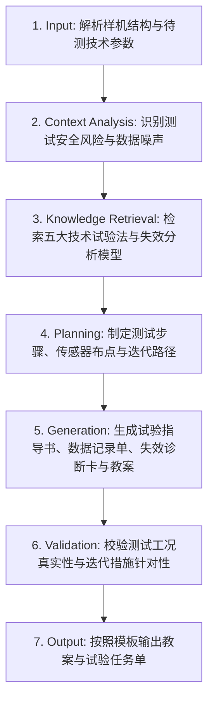

# 试验测试与迭代优化 (Testing & Iterative Optimization)

## 1. 技能概述 (Description & Purpose)
本技能负责技术试验（Technical Testing）与工程迭代（Engineering Iteration）教学设计。涵盖**技术试验类型（优选试验法、模拟试验法、虚拟试验法、强化试验法、移植试验法）**、测试数据采集、失效机理分析与结构/参数的二次重构优化。

## 2. 适用边界 (When to use / When NOT to use)
- **何时使用**：
  - 样机制作完成后，开展破坏性测试、耐久度测试、气密性检测、电路带载调试时。
  - 引导学生从测试失败中寻找改进灵感，进行工程迭代升级时。
- **何时不使用**：
  - 初始需求定义与方案头脑风暴阶段（请使用 `te.technology-design`）。

## 3. 输入与约束 (Inputs & Constraints)
- **输入参数**：
  - `tested_prototype`: 待测试的工程样机名称
  - `experiment_method`: 采用的技术试验方法（如模拟试验、强化试验）
  - `failure_modes`: 预期或常见失效模式（如焊点脱落、轴承发热、共振断裂）
- **教学约束**：
  - 必须包含严谨的“试验记录报告单”与对照实验控制变量设计。
  - 必须产出具体的“迭代优化工程方案对比表（Before vs After）”。

## 4. 标准执行工作流 (Workflow)

### 环节详解：
1. **Input**：接收样机测试目标与测试仪器设备。
2. **Context Analysis**：评估测试中的安全防护需求及数据误差来源。
3. **Knowledge Retrieval**：调取普通高中通用技术五大试验方法与工程失效学常识。
4. **Planning**：确定测试工况条件（载荷梯度、环境温度、振动频率）及数据采集点。
5. **Generation**：输出任务单中的试验操作规范、数据曲线记录表、失效机理分析树及结构增强方案。
6. **Validation**：确保测试过程可重复、数据可验证。
7. **Output**：生成教案与学习任务单。

## 5. 质量评估基准 (Quality Criteria)
- [ ] **试验方法规范**：明确指出属于哪一种技术试验方法（如强化试验法）。
- [ ] **证据闭环**：迭代方案直接针对测试中暴露的数据缺陷或断裂点，具有因果证据链。

## 6. 关联资源与产物 (Dependencies & Outputs)
- **依赖技能**：`core.lesson-design`, `core.activity-design`
- **关联模板**：`templates/lesson-plan/lesson-plan.md`, `templates/task-sheet/task-sheet.md`
- **关联知识**：`knowledge/technology-engineering/pedagogy/engineering-design-loop.md`
